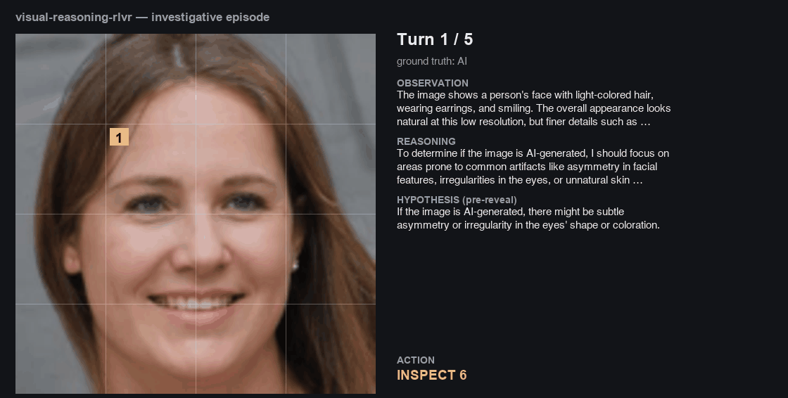

# visual-reasoning-rlvr

**A verifiable RL environment and full post-training pipeline for investigative
visual reasoning.**

An agentic RL environment where a VLM investigates an image under a
resolution/action budget — forming testable hypotheses, inspecting regions to
confirm or refute them, and committing a verdict — trained so that *reasoning is
the only efficient path to reward*. The task: decide whether an image is a real
photograph or AI-generated. The point: a reward that is **mechanically
verifiable end to end — no LLM judge anywhere.**

> The interesting artifact here is the **reward**, not the detector. See
> [`results/reward_failure_history.md`](results/reward_failure_history.md) for the
> four iterations it took to get a signal that is both *faithful* and *learnable*.



*A single episode on a Qwen2.5-VL-32B policy. The overview is deliberately
unresolvable — each `INSPECT` sharpens one cell, and the numbered badges are the
inspect order. The right panel is the structured block the model emitted; the
reward reads only its machine-checkable fields (`P(fake)`, reconciliation
direction, verdict, confidence), never the prose. Per-turn stills are in
[`docs/frames/`](docs/frames). Regenerate with `python tools/traces_to_demo.py &&
python tools/make_demo_gif.py --frames`.*

---

## The core idea

The environment makes the correct answer **unreachable without reasoning**. The
agent starts with only a low-resolution overview (partial observability), must
spend a limited budget to sharpen regions, and must commit a **falsifiable
hypothesis before each reveal**. A correct final verdict is therefore evidence
that genuine investigation occurred. Reasoning is forced *structurally* — never
scored for eloquence.

### Action space (two actions, locked)

| Action | Effect |
|---|---|
| `INSPECT <n>` | reveal grid cell *n* (1–16, a 4×4 grid) at high resolution — the only information-acquisition action; costs budget |
| `VERDICT <AI\|REAL> confidence=<c>` | commit and end the episode |

### Predict-then-verify (the locked invariant)

Every turn is one structured block. The **hypothesis is committed before the
reveal**; the reveal is reconciled against it on the next turn. Predict → observe,
never observe → narrate.

```
RECONCILIATION: CONFIRMED/REFUTED — did the last reveal match my hypothesis?   (post)
BELIEF_UPDATE:  P(fake)=0.75 because …                                          (post)
OBSERVATION:    what I perceive at current resolution                           (pre)
REASONING:      why this region matters / my uncertainty                        (pre)
HYPOTHESIS:     if AI, the left iris in cell 6 will be malformed                (pre)
ACTION:         INSPECT 6   |   VERDICT AI confidence=0.85
```

## The verifiable reward

Every term is a mechanical function of the trajectory + ground-truth label
(`env/reward.py`, unit-tested in `tests/`):

```
R = +1.00·verdict_correct        final label vs ground truth
    +0.30·belief_coherence       P(fake) moved as the agent's own reconciliations imply
    +0.30·verdict_consistency    the final call follows the accumulated evidence
    +0.10·prediction_tracking    (soft) fraction of hypotheses confirmed
    −0.05·per_inspect            budget pressure → hypothesis-driven, not exhaustive
    −0.50·confident_wrong·conf    calibration pressure → hedge when indistinguishable
    −1.00·no_answer
```

`verdict_correct` dominates so process credit can never rescue a confidently-wrong
episode. The reward reads only numeric beliefs and reconciliation *direction* —
never prose — so boilerplate reasoning earns nothing. Full rationale + the
reward-hacking surface: [`results/reward_failure_history.md`](results/reward_failure_history.md).

## Difficulty (two honest axes, plus one breakdown)

`generator` is categorical, not ordered, so it gives a breakdown rather than a
difficulty ladder. Difficulty is manufactured two ways instead: **image
degradation** (`clean → jpeg → blur_downscale`) and **budget tightness** (fewer
allowed inspects). The eval harness reports pass rate across both — the
calibration deliverable: *"to target model X at ~50% pass, use degradation Y at
budget k."* It also breaks pass rate down **per generator** (ADM, BigGAN, GLIDE,
Midjourney, SD 1.4/1.5, VQDM, Wukong), which separates "detects BigGAN, blind to
Midjourney" from "uniformly weak".

These axes are not only reporting dimensions. They are the knobs that put the
policy in the band where GRPO has a gradient at all — see **Before you train**
below.

## Pipeline

| Stage | What | Script |
|---|---|---|
| −1 | **Substrate gate** — ceiling ≥0.85, floor ≈chance | `tools/ceiling_probe.py` |
| 0 | Baseline eval (zero-shot pass rate per degradation) | `eval/harness.py` |
| 1 | **SFT** — teach the pre/post format from distilled traces | `training/sft.py` |
| 1.5 | **GRPO gate** — do groups of rollouts actually disagree? | `tools/group_variance_probe.py` |
| 2 | **GRPO** — online RL vs the verifiable reward, KL-anchored to SFT | `training/grpo.py` |
| 3 | **Verification** — prove the gains are real (below) | `eval/harness.py` |

The two gates are cheap and they are not optional. Skipping stage −1 cost this
project a full pipeline build on an unlearnable substrate
([`results/faces_negative_result.md`](results/faces_negative_result.md)); stage
1.5 is the same discipline applied to the question stage −1 does not answer.
See **Before you train** below.

Base model **Qwen2.5-VL-32B-Instruct** (`--model 7b | 32b | 72b | auto`).
Inference via **vLLM** with tensor parallelism (eval + trace distillation);
training rollouts via HF `generate` (needs logprobs). Training is data-parallel
across GPUs/nodes with **DeepSpeed ZeRO** sharding inside the group. All stages
logged to **W&B**. DPO was cut — data-starved at this scale; SFT→GRPO suffices.

### Headline result (populate after runs)

Pass rate per stage × degradation, `test` split:

| Stage | clean | jpeg | blur_downscale |
|---|---|---|---|
| Baseline | – | – | – |
| SFT | – | – | – |
| GRPO | – | – | – |

### Stage 3 — proving the learning is real

Held-out degradation · trajectory audit (`demo/app.py`) · grounding-term ablation
· adversarial-trajectory probe (unit-tested) · calibration curve · evidence slice
(GradCAM-proposed, human-verified fake cells; eval-only) — do RL rollouts inspect
true-artifact cells more than SFT? Indistinguishable images are scoped out of that
metric but still counted in accuracy.

---

## Before you train

Two measurements, ~15 minutes each, that decide whether the expensive stages can
work at all. Both exist because the project once skipped the first one.

### Gate 1 — is the substrate learnable? (`tools/ceiling_probe.py`)

Strip the environment away entirely: native resolution, one question, one word,
no budget, no format. Then do it again through the env's blurred overview.

| | want | reads as |
|---|---|---|
| **ceiling** (`--condition full`) | ≥0.85 | the model *can* know the answer |
| **floor** (`--condition overview`) | ≈chance | the overview genuinely withholds it |

The **gap between them is the only room investigation has to work in.** A low
ceiling means no amount of RL will help. A high floor means the model is reading a
global low-level statistic that survives downsampling — on GenImage that is the
compression confound (see [`data/curation.md`](data/curation.md)), and it makes
the investigation decorative. Read the confusion matrix, not just the accuracy:
the face substrate scored 0.390 *and* predicted "AI" on 4 of 100 images, and only
the second number was actionable.

### Gate 2 — will GRPO have a gradient? (`tools/group_variance_probe.py`)

Run this on the **SFT checkpoint**, not the base model — it is where GRPO starts.

GRPO has no critic. It scores a group of `G` rollouts on the same image and uses
each rollout's advantage relative to that group's mean. If every rollout in a
group reaches the same verdict, `verdict_correct` (±1.0, the dominant term) is
constant inside the group and contributes nothing.

That is worse than a no-op. The process terms (0.70 of the weight, combined) still
vary, so the gradient does not vanish — it **redirects**, and the run spends its
budget teaching the policy to write internally-coherent investigations decoupled
from whether they reach the right answer. That is precisely the pathology
[`results/reward_failure_history.md`](results/reward_failure_history.md) exists to
prevent, arriving through the data instead of through the reward.

The probe reports `usable_groups` — the fraction of groups containing both a right
and a wrong rollout:

| `usable_groups` | verdict |
|---|---|
| ≥0.40 | healthy — launch GRPO |
| 0.15–0.40 | thin — expect slow, noisy progress; tune difficulty first |
| <0.15 | do not launch — check `all_wrong` vs `all_correct` for which way to move |

`all_wrong` says the task is too hard for this policy (ease the degradation, raise
the budget); `all_correct` says it is too easy (tighten them). This is what the
difficulty axes are *for* — landing the pass rate near 0.5, where the outcome term
carries the signal.

---

## Quickstart

```bash
pip install -r requirements.txt            # CORE profile is CPU-only

# --- runs anywhere (no GPU) ---
pytest tests/                              # verifiable-reward + trajectory + env tests
python -m env.environment                  # scripted-policy smoke test (+ reward breakdown)

# --- data (needs Kaggle creds) ---
export VRR_DATASET=genimage                # namespaces every artifact (see below)
python data/build_manifest_genimage.py --src /path/to/GenImage --per-generator 200
#   → data/genimage/manifest.jsonl (+ data/genimage/images/)

# Before training anything on a new substrate, measure whether it CAN work:
python tools/ceiling_probe.py --backend vllm --tensor-parallel-size 2 \
    --condition full                       # ceiling — want >=0.85
python tools/ceiling_probe.py --backend vllm --tensor-parallel-size 2 \
    --condition overview                   # floor  — want ~chance

# After SFT, before GRPO: does the policy produce groups that disagree?
python tools/group_variance_probe.py --backend vllm --tensor-parallel-size 2 \
    --adapter checkpoints/$VRR_DATASET/sft-qwen2.5-vl-32b --images 32 -G 8

# --- single GPU (7B tier, smoke runs) ---
python data/build_sft_traces.py --model 7b --limit 200
python training/sft.py  --model 7b
python training/grpo.py --model 7b --sft-checkpoint checkpoints/$VRR_DATASET/sft-qwen2.5-vl-7b
python eval/harness.py  --model 7b --adapter checkpoints/$VRR_DATASET/grpo-qwen2.5-vl-7b --compare-base

# --- one 8-GPU node (32B tier) ---
python data/build_sft_traces.py --backend vllm --tensor-parallel-size 8 \
    --batch-episodes 32 --limit 1200                              # distill (vLLM TP)
accelerate launch --config_file configs/accelerate_ds_zero2.yaml \
    training/sft.py --model 32b                                   # Stage 1
accelerate launch --config_file configs/accelerate_ds_zero2.yaml \
    training/grpo.py --sft-checkpoint checkpoints/$VRR_DATASET/sft-qwen2.5-vl-32b   # Stage 2
python eval/harness.py --backend vllm --tensor-parallel-size 8 --batch-episodes 32 \
    --adapter checkpoints/$VRR_DATASET/grpo-qwen2.5-vl-32b \
    --budgets 2,4 --degradations clean,jpeg,blur_downscale --compare-base

# --- SLURM (VT ARC: TinkerCliffs A100 / Falcon H200) ---
# Gates first — small and short, so override the 8-GPU/8h job defaults.
JOB=ceiling sbatch --gres=gpu:2 --time=00:30:00 scripts/arc_infer.slurm
JOB=floor   sbatch --gres=gpu:2 --time=00:30:00 scripts/arc_infer.slurm
JOB=distill sbatch scripts/arc_infer.slurm                  # only if the gate passed
sbatch scripts/arc_sft.slurm                                # 32B, 1 node, ZeRO-2
JOB=groupvar ADAPTER=checkpoints/$VRR_DATASET/sft-qwen2.5-vl-32b \
    sbatch --gres=gpu:4 --time=02:00:00 scripts/arc_infer.slurm   # gate 2
MODEL=72b DS=configs/deepspeed_zero3.json sbatch --nodes=2 scripts/arc_sft.slurm
SFT_CKPT=checkpoints/$VRR_DATASET/sft-qwen2.5-vl-32b sbatch scripts/arc_grpo.slurm   # 32B, 2 nodes, ZeRO-2
SFT_CKPT=checkpoints/$VRR_DATASET/sft-qwen2.5-vl-32b sbatch --nodes=1 scripts/arc_grpo.slurm  # ~2× wall clock
JOB=eval ADAPTER=checkpoints/$VRR_DATASET/grpo-qwen2.5-vl-32b sbatch scripts/arc_infer.slurm

# --- demo ---
python demo/app.py --log logs/grpo_episodes.jsonl
```

## Monitoring a run (W&B)

**One-time setup on the login node** (`wandb` is already in the TRAINING profile
of `requirements.txt`):

```bash
conda activate vrr
wandb login                 # writes ~/.netrc; $HOME is mounted on the compute
                            # nodes, so jobs inherit the credential
```

Prefer `~/.netrc` over an env var — the key never enters the repo or a job
script. If you would rather use a variable, put it *outside* the repo in
`~/.config/vrr/secrets.env` (`export WANDB_API_KEY=...`, `chmod 600`);
`scripts/arc_env.sh` sources that file if it exists. **Never put the key in
`arc_env.sh` — it is tracked in git.**

`arc_env.sh` then preflights the credential and the route to `api.wandb.ai` and
exports `WANDB_MODE` accordingly. No credential or no outbound route (common on
HPC compute nodes) falls back to `offline` instead of failing or hanging the job:

```bash
# check from a compute node BEFORE burning an allocation
srun --partition=a100_normal_q --gres=gpu:0 --time=00:05:00 --pty \
  curl -s -o /dev/null -w '%{http_code}\n' https://api.wandb.ai/graphql   # 405 = reachable, 000 = blocked
# if it was offline, replay the run afterwards from the login node:
wandb sync /projects/$USER/wandb/offline-run-*
```


Long SLURM jobs are meant to be followed from the W&B dashboard, not from an SSH
session on the compute node. Both training scripts call `common.wandb_init`,
which stamps the run with its SLURM identity (`slurm_job_id`, `slurm_nodelist`,
`slurm_partition`, `num_nodes`, `world_size`) and names it
`grpo-Qwen2.5-VL-32B-Instruct-j<jobid>`. The run id is keyed on the SLURM job id,
so a **requeued job re-attaches to the same run** rather than fragmenting the
charts. Rank 0 prints the run URL to `logs/slurm/grpo-<jobid>.out` at startup.

Alongside the usual loss / `rollout/*` metrics, `common.progress_callback` logs:

| Metric | Reads as |
|---|---|
| `progress/pct_complete`, `progress/global_step` | how far in |
| `progress/sec_per_step` | EMA-smoothed step time (first step excluded — it carries warmup) |
| `progress/eta_hours`, `progress/finish_unixtime` | **time left**, and projected finish |
| `progress/walltime_left_hours` | time until SLURM kills the job (from `scontrol EndTime`) |
| `progress/walltime_margin_hours` | ETA vs. that deadline — **negative means it will not finish** |
| `progress/will_finish` | the same as a 1/0 line to alert on |

`wandb.run.summary["progress/eta"]` holds the projected finish as a timestamp, so
it is visible in the runs table without opening a chart. When the margin first
goes negative the run fires a **`wandb.alert`** — that is the signal to requeue
with more nodes or cap `--max-steps`, and it reaches you without an SSH session.
Off SLURM (or without `scontrol`) the walltime rows are simply omitted; the ETA
rows still work.

## Scaling notes

| Tier | Weights (bf16) | Training shape | Inference shape |
|---|---|---|---|
| `7b` | ~17 GB | 1 GPU, LoRA | 1 GPU |
| `32b` | ~66 GB | 8×A100-80 / H200, LoRA + **ZeRO-2** | vLLM TP=4–8 |
| `72b` | ~147 GB | 8–16 GPUs, LoRA + **ZeRO-3** (`_offload` if tight) | vLLM TP=8 |

* **Training** is data-parallel: accelerate shards the seed dataset across ranks,
  each rank runs its own `InvestigationEnv` and rollouts, gradients are reduced.
  GRPO stays on **ZeRO-2** by default — every rollout turn calls `generate()`, and
  ZeRO-3 gathers the sharded parameters once per turn (handled correctly via
  `unwrap_model_for_generation`, just slower).
* **Inference** picks one of two parallelisms, never both: vLLM **tensor
  parallel** (one big replica across the node, episodes advanced in lockstep by
  `run_episodes_batched`) or **rank sharding** under `torchrun` (one replica per
  GPU, test split strided across ranks and all-gathered). The evidence slice
  reads next-token logits, so it is HF/rank-sharded only.
* `--compare-base` disables the LoRA adapter instead of loading a second model —
  the base/policy comparison costs one replica's VRAM, not two.
* The visual-token budget (`DEFAULT_MIN_PIXELS` / `DEFAULT_MAX_PIXELS` in
  `training/common.py`) caps each image at 256–1280 patch tokens; an episode
  carries the overview plus every reveal, so this is the knob that keeps a
  4-inspect context inside ~8k tokens at 32B/72B.

## Repository

```
env/         environment.py · reward.py · trajectory.py · grid.py · prompts.py (domain registry) · trace_logger.py
data/        build_manifest.py · build_manifest_genimage.py · degradation.py · build_sft_traces.py · build_evidence_slice.py · curation.md
tools/       ceiling_probe.py · group_variance_probe.py · traces_to_demo.py · make_demo_gif.py
training/    common.py · vllm_backend.py · sft.py · grpo.py
eval/        harness.py               (pass-rate × degradation × budget, calibration, evidence slice)
configs/     accelerate_ds_zero{2,3}.yaml · accelerate_fsdp.yaml · deepspeed_zero{2,3,3_offload}.json
scripts/     arc_env.sh · arc_sft.slurm · arc_grpo.slurm · arc_infer.slurm   (VT ARC SLURM)
tests/       test_reward.py · test_trajectory.py · test_environment.py · test_prompts.py · test_reporting.py   (CI target)
demo/        app.py                   (Gradio step-by-step trajectory viewer)
results/     reward_failure_history.md · curves/tables
Dockerfile · .github/workflows/ci.yml
```

Substrate: [GenImage](https://github.com/GenImage-Dataset/GenImage) — real
ImageNet photographs vs. eight generators (ADM, BigGAN, GLIDE, Midjourney, SD
1.4/1.5, VQDM, Wukong), image-level labels only. The 300×300 StyleGAN2 face set is
**retired**: the base VLM could not separate its classes at all, measured in
[`results/faces_negative_result.md`](results/faces_negative_result.md). See
[`data/curation.md`](data/curation.md) for both, and for the GenImage compression
confound and how the floor probe detects it.
